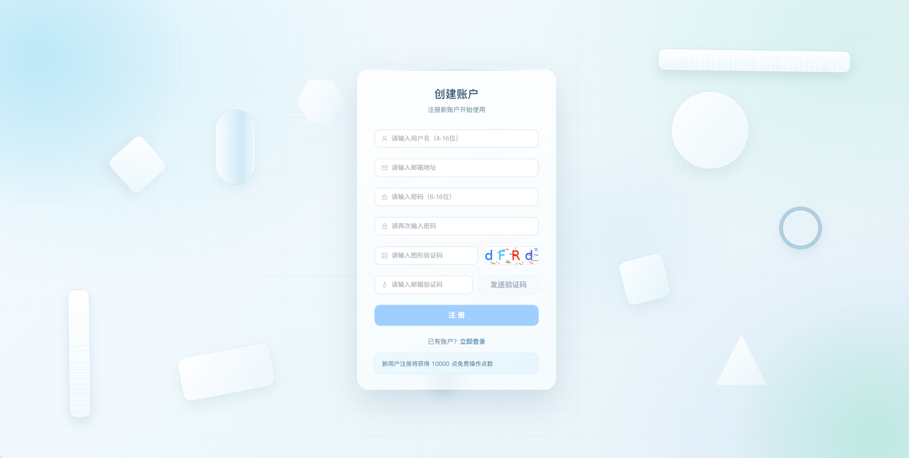
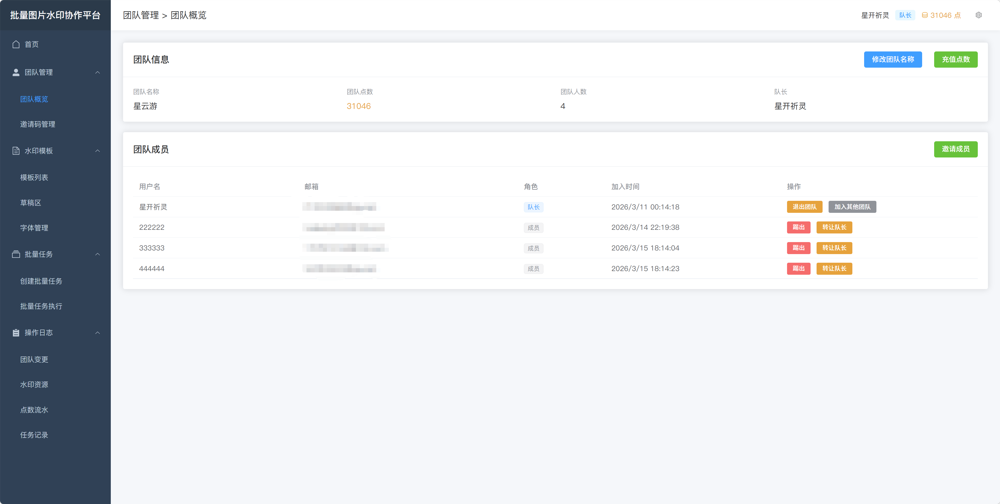
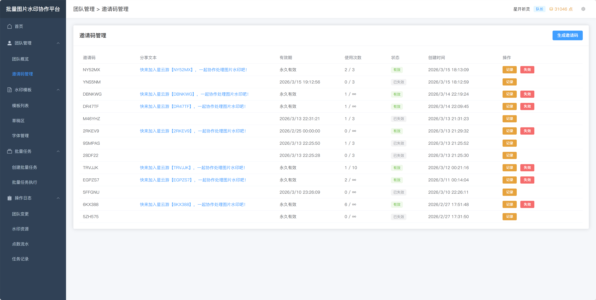
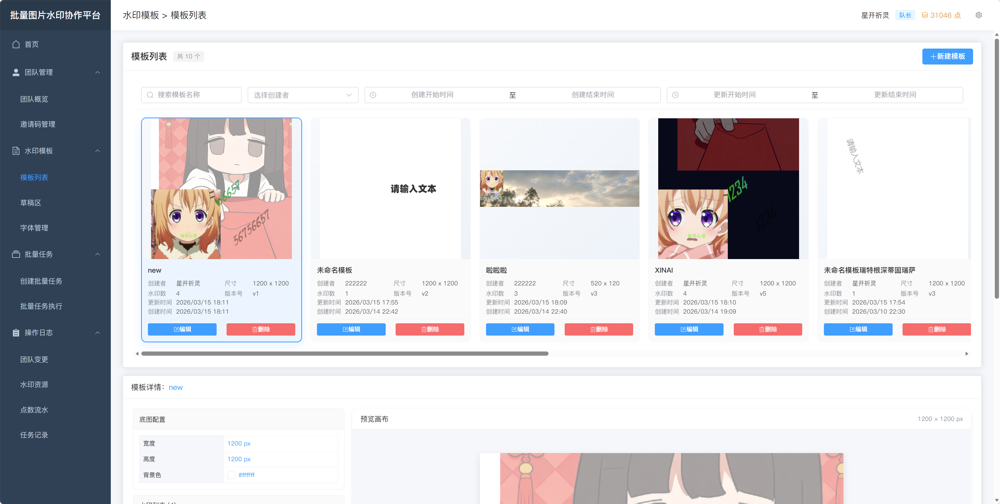
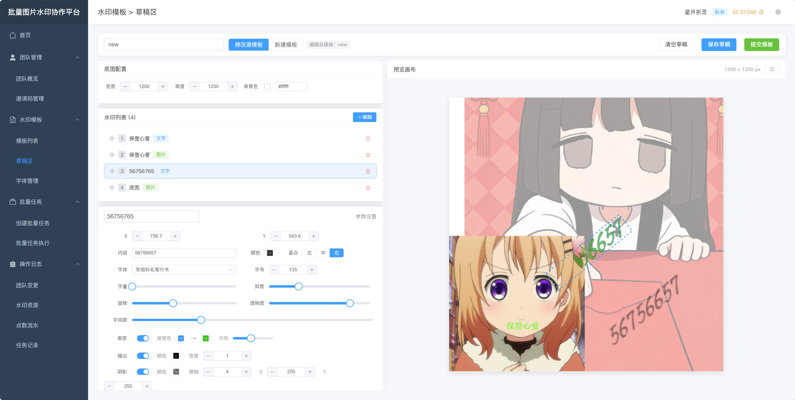
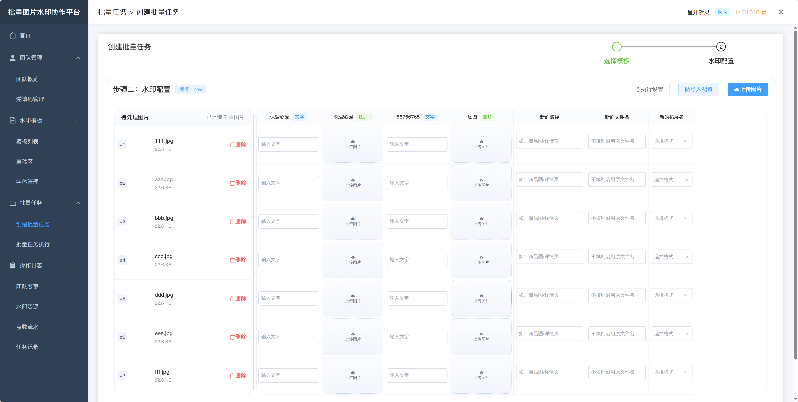
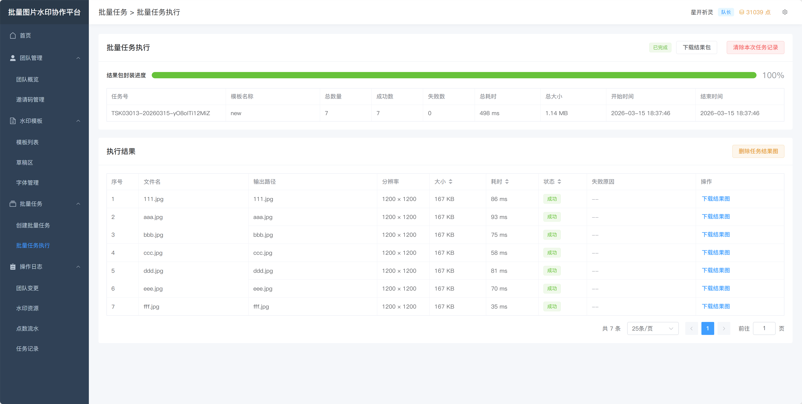
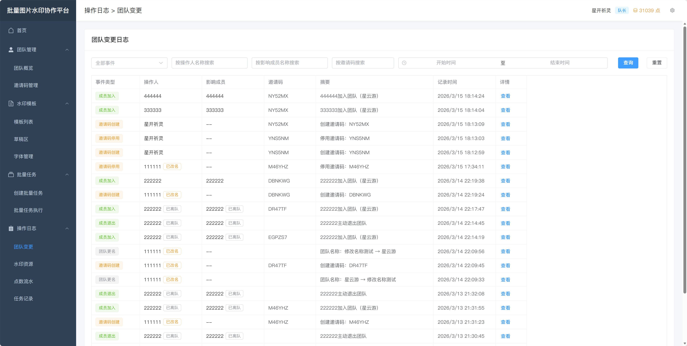
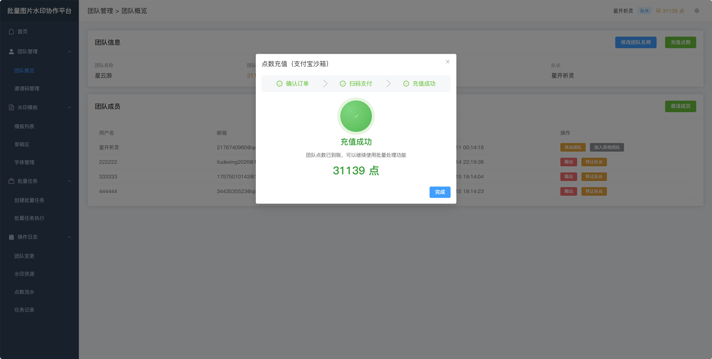

# team-watermark-system

毕业设计项目 | 基于 Spring Boot + Vue3 的批量图片水印协作平台，面向电商团队批量改图与协作管理场景


## 项目简介

这是一个围绕“团队协作 + 模板化 + 批处理”构建的水印平台，覆盖从模板制作到任务执行再到日志复盘的完整流程

核心能力：

- 团队协作：成员共享模板、点数、任务与日志，支持邀请码加入、成员管理与队长转让
- 模板草稿：支持模板列表与草稿区编辑，提供冲突检测与提交策略（新增/修改）
- Excel 映射：支持按图片 ID 或按顺序映射水印参数，适配批量业务输入
- 异步任务：批量任务执行进度可视化，支持结果包下载、失败项定位与重试
- 点数与日志：提供点数预扣/返还、充值能力，以及团队/资源/任务/点数日志审计


## 快速开始

### 环境要求

- Java 21
- Maven 3.9+
- Node.js 18+
- MySQL 8.0
- Redis 6+
- MinIO

### 启动步骤

1. 启动后端服务

```bash
cd backend
mvn spring-boot:run
```

2. 启动前端服务

```bash
cd frontend
npm run dev
```

3. 访问系统

- 前端开发地址：`http://localhost:5173`
- 后端默认地址：`http://localhost:8080`
- 后端接口文档：`http://localhost:8080/doc.html`

### 关键配置说明

- 后端开发配置：`backend/src/main/resources/application-dev.yaml`
  - 默认端口、MySQL、Redis、MinIO、邮件、支付宝沙箱等基础配置
- 后端系统参数：`backend/src/main/resources/system.yaml`
  - 点数、验证码、批量任务限制、二维码、模板默认值、JWT 参数等
- 前端本地环境：`frontend/.env`
  - `VITE_API_BASE_URL`（本地通常指向 `http://localhost:8080`）
- 前端生产环境：`frontend/.env.production`
  - `VITE_API_BASE_URL`（线上环境后端网关地址）


## 使用说明

在线体验地址：[http://8.163.35.18](http://8.163.35.18)

### 1. 登录与账号准备

注册需要绑定邮箱，登录页支持密码登录与验证码登录




### 2. 团队管理

团队概览展示成员与点数余额，邀请码管理用于拉新成员并追踪使用状态




### 3. 模板与草稿编辑

模板列表用于查找/筛选模板，草稿编辑器用于配置文字/图片水印并实时预览




### 4. 创建批量任务

先选模板，再上传图片并配置参数（可导入 Excel 基座模板进行批量映射）



### 5. 执行任务与结果下载

任务执行页展示实时进度、成功失败统计与结果下载入口



### 6. 日志复盘与点数结算

日志中心支持按类型筛选复盘；点数充值用于补充团队可执行额度





## 技术栈

| 前端 | 后端 | 基础设施 |
| --- | --- | --- |
| Vue 3.4+、TypeScript 5、Vite 5、Pinia、Vue Router 4、Element Plus | Java 21、Spring Boot 3.5.10、MyBatis-Plus 3.5.7、JWT、EasyExcel、Knife4j | MySQL 8.0、Redis 6+、MinIO、Alipay Sandbox |


## 版本控制

- 分支策略：
  - `main`：稳定分支（可发布）
  - `dev`：开发分支（日常迭代）
- 提交信息：
  - `feat：` 新功能
  - `fix：` 缺陷修复
  - `docs：` 文档更新
- 版本记录：
  - 参考项目更新日志：[changelog.md](frontend/public/home/docs/changelog.md)


## 许可证

本项目采用 [MIT License](LICENSE)


## 联系方式

- Issues：<https://github.com/KokoaChino/team-watermark-system/issues>
- 邮箱：<mailto:2178740980@qq.com>
- Bilibili：<https://space.bilibili.com/497982061>
